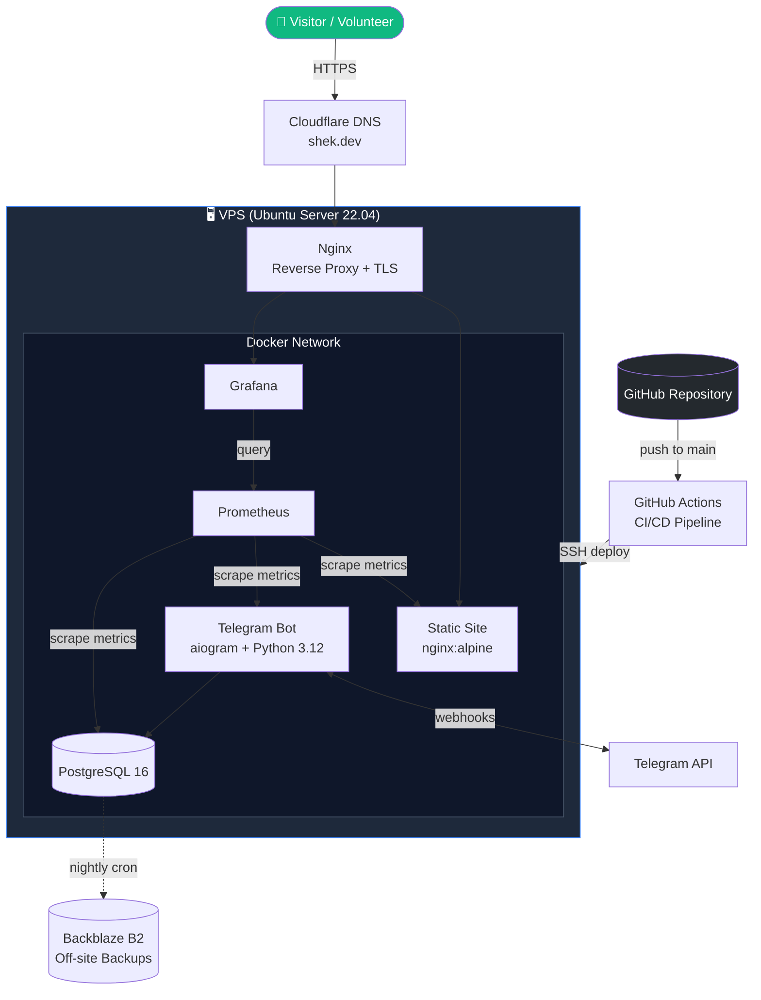

# shek.dev — Personal DevOps Portfolio Infrastructure
 
> Personal portfolio website and Telegram bot infrastructure, deployed on a self-managed VPS with full DevOps stack: Docker, CI/CD, monitoring, and automated backups.
 
[](https://github.com/c001guard/shek-dev)
[](https://www.docker.com/)
[](https://github.com/features/actions)
[](https://shek.dev)
[](LICENSE)
 
🌐 **Live:** [shek.dev](https://shek.dev) *(coming soon)*
🇷🇺 **Russian version:** [README.ru.md](./README.ru.md)
 
---
 
## 📋 About This Project
 
This is a real-world DevOps portfolio project that combines **a personal resume website** and **a Telegram bot for volunteer coordination** into a single self-hosted infrastructure.
 
The project demonstrates the full DevOps lifecycle:
 
- **Infrastructure as Code** — everything reproducible from `docker-compose.yml`
- **Containerization** — every service runs in its own Docker container
- **Automated CI/CD** — push to `main` triggers automatic deployment
- **Monitoring & Observability** — Prometheus + Grafana with public dashboards
- **HTTPS & Security** — Let's Encrypt certificates, hardened SSH, firewall rules
- **Backups & Disaster Recovery** — automated PostgreSQL backups to off-site storage
---
 
## 🏗️ Architecture
 

 
---
 
## 🛠️ Tech Stack
 
| Layer            | Technology                                  |
| ---------------- | ------------------------------------------- |
| **OS**           | Ubuntu Server 22.04 LTS                     |
| **Containers**   | Docker, docker-compose                      |
| **Web Server**   | Nginx (reverse proxy + TLS termination)     |
| **TLS**          | Let's Encrypt (certbot, auto-renewal)       |
| **Site**         | HTML5 / CSS3 / Vanilla JS                   |
| **Bot**          | Python 3.12, aiogram 3.x, APScheduler       |
| **Database**     | PostgreSQL 16, Alembic migrations           |
| **Monitoring**   | Prometheus, Grafana, node-exporter          |
| **CI/CD**        | GitHub Actions                              |
| **DNS**          | Cloudflare                                  |
| **Backups**      | rclone → Backblaze B2                       |
| **Secrets**      | GitHub Secrets, environment variables       |
 
---
 
## 📂 Repository Structure
 
```
shek-dev/
├── docker-compose.yml              # Service orchestration
├── docker-compose.dev.yml          # Local development overrides
├── .env.example                    # Environment variables template
├── .github/
│   └── workflows/
│       ├── deploy.yml              # CI/CD: deploy to VPS on push
│       └── ci.yml                  # Linting, tests, security checks
├── nginx/
│   ├── nginx.conf                  # Reverse proxy configuration
│   └── ssl/                        # Let's Encrypt certificates (gitignored)
├── site/                           # Personal resume website
│   ├── Dockerfile
│   └── public/
├── bot/                            # Telegram bot for volunteers
│   ├── Dockerfile
│   ├── pyproject.toml
│   ├── src/
│   ├── tests/
│   └── alembic/
├── monitoring/
│   ├── prometheus.yml
│   └── grafana/
└── docs/
    ├── architecture.md             # Detailed architecture
    ├── deployment.md               # How to deploy from scratch
    └── post-mortem-bot-v1.md       # Lessons from the first bot version
```
 
---
 
## 🤖 The Volunteer Bot
 
The Telegram bot handles shift tracking for the School 21 volunteer team I lead (20+ volunteers).
 
**v1 (previous version):** the bot was technically working but had a critical UX problem — volunteers kept forgetting to mark their shifts. After a few weeks of low adoption, the bot was paused.
 
**v2 (this version):** rebuilt with lessons learned:
- ⏰ **Automatic reminders** before each shift (APScheduler)
- 🚀 **One-click check-in** via inline buttons (no commands to memorize)
- 📊 **Escalation alerts** to the team lead if a volunteer misses a shift
- 📈 **Live metrics** exposed to Prometheus (active users, check-in rate)
The full retrospective on what went wrong and how it was fixed is in [`docs/post-mortem-bot-v1.md`](./docs/post-mortem-bot-v1.md).
 
---
 
## 🗺️ Roadmap
 
### Phase 1 — Infrastructure & Static Site `📋 In progress`
- [x] Architecture design and documentation
- [ ] VPS provisioning, SSH hardening, firewall
- [ ] Docker + docker-compose setup
- [ ] Static site with resume content
- [ ] Nginx reverse proxy
- [ ] Let's Encrypt HTTPS
### Phase 2 — CI/CD `⏳ Planned`
- [ ] GitHub Actions deploy workflow
- [ ] SSH deploy keys via GitHub Secrets
- [ ] Automated rollout on push to `main`
### Phase 3 — Volunteer Bot v2 `⏳ Planned`
- [ ] Migrate bot codebase into the monorepo
- [ ] Implement automatic reminders (APScheduler)
- [ ] Inline-button check-in flow
- [ ] PostgreSQL with Alembic migrations
- [ ] Prometheus metrics endpoint
### Phase 4 — Monitoring `⏳ Planned`
- [ ] Prometheus + Grafana stack
- [ ] node-exporter, nginx-exporter
- [ ] Public Grafana dashboard
- [ ] Alerting via Telegram
### Phase 5 — Polish & Reliability `⏳ Planned`
- [ ] Automated PostgreSQL backups → Backblaze B2
- [ ] Log rotation
- [ ] Health checks for all services
- [ ] Uptime monitoring
---
 
## 👤 About Me
 
**Valerii Shek** — aspiring DevOps Engineer / System Administrator based in Tashkent, Uzbekistan.
 
Currently studying at School 21 (Sber) on the System Administration / DevOps track, while teaching Python and IT fundamentals at three educational institutions in Tashkent. Available for full-time work starting **July 2026**.
 
📫 **Get in touch:**
- ✉️ Email: [val_shek@mail.ru](mailto:val_shek@mail.ru)
- 📱 Telegram: [@c001ermsc](https://t.me/c001ermsc)
- 💻 GitHub: [@c001guard](https://github.com/c001guard)
---
 
## 📄 License
 
MIT — see [LICENSE](LICENSE) for details.
 
The website content (texts, photos) is © Valerii Shek, all rights reserved.
The infrastructure code is open source — feel free to use it as a reference for your own portfolio project.
