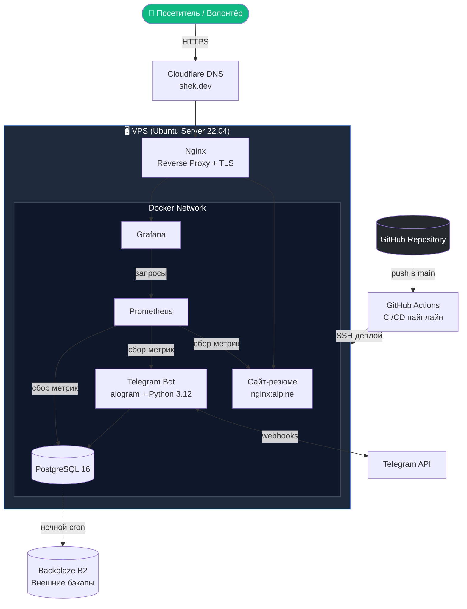

# shek.dev — Личное DevOps-портфолио и инфраструктура
 
> Личный сайт-резюме и Telegram-бот для координации волонтёров, развёрнутые на собственном VPS с полным DevOps-стеком: Docker, CI/CD, мониторинг и автоматические бэкапы.
 

 
🌐 **Live:** [shek.dev](https://shek.dev) *(скоро)*
🇬🇧 **English version:** [README.md](./README.md)
 
---
 
## 📋 О проекте
 
Это полноценный DevOps-проект, объединяющий **личный сайт-резюме** и **Telegram-бот для координации волонтёров** в единую самостоятельную инфраструктуру.
 
Проект демонстрирует полный жизненный цикл DevOps-инженера:
 
- **Infrastructure as Code** — вся инфраструктура воспроизводится из `docker-compose.yml`
- **Контейнеризация** — каждый сервис запускается в своём Docker-контейнере
- **Автоматический CI/CD** — push в `main` запускает автодеплой
- **Мониторинг и наблюдаемость** — Prometheus + Grafana с публичными дашбордами
- **HTTPS и безопасность** — сертификаты Let's Encrypt, защищённый SSH, firewall
- **Бэкапы и восстановление** — автоматические бэкапы PostgreSQL во внешнее хранилище
---
 
## 🏗️ Архитектура
 

 
---
 
## 🛠️ Технологический стек
 
| Уровень          | Технология                                  |
| ---------------- | ------------------------------------------- |
| **ОС**           | Ubuntu Server 22.04 LTS                     |
| **Контейнеры**   | Docker, docker-compose                      |
| **Веб-сервер**   | Nginx (reverse proxy + TLS termination)     |
| **TLS**          | Let's Encrypt (certbot, автообновление)     |
| **Сайт**         | HTML5 / CSS3 / Vanilla JS                   |
| **Бот**          | Python 3.12, aiogram 3.x, APScheduler       |
| **БД**           | PostgreSQL 16, миграции Alembic             |
| **Мониторинг**   | Prometheus, Grafana, node-exporter          |
| **CI/CD**        | GitHub Actions                              |
| **DNS**          | Cloudflare                                  |
| **Бэкапы**       | rclone → Backblaze B2                       |
| **Секреты**      | GitHub Secrets, переменные окружения        |
 
---
 
## 🤖 Бот для волонтёров
 
Telegram-бот обслуживает учёт смен команды волонтёров кампуса School 21, которой я руковожу как тим-лид (20+ человек).
 
**v1 (предыдущая версия):** бот технически работал, но имел критическую UX-проблему — волонтёры регулярно забывали отмечать свои смены. Через несколько недель низкого вовлечения бот был временно остановлен.
 
**v2 (текущая версия):** переработан с учётом полученных уроков:
- ⏰ **Автоматические напоминания** перед каждой сменой (APScheduler)
- 🚀 **One-click чекин** через inline-кнопки (без необходимости запоминать команды)
- 📊 **Эскалация тим-лиду**, если волонтёр пропустил смену
- 📈 **Метрики в Prometheus** (активные пользователи, процент чекинов)
Полный разбор того, что пошло не так в первой версии и как это было исправлено — в [`docs/post-mortem-bot-v1.md`](./docs/post-mortem-bot-v1.md).
 
---
 
## 🗺️ Дорожная карта
 
### Этап 1 — Инфраструктура и статический сайт `📋 В процессе`
- [x] Проектирование архитектуры и документация
- [ ] Настройка VPS, защита SSH, firewall
- [ ] Установка Docker + docker-compose
- [ ] Статический сайт с резюме
- [ ] Nginx reverse proxy
- [ ] HTTPS через Let's Encrypt
### Этап 2 — CI/CD `⏳ Запланировано`
- [ ] GitHub Actions workflow для деплоя
- [ ] SSH deploy-ключи через GitHub Secrets
- [ ] Автодеплой при push в `main`
### Этап 3 — Бот волонтёров v2 `⏳ Запланировано`
- [ ] Перенос кода бота в монорепо
- [ ] Автоматические напоминания (APScheduler)
- [ ] Чекин через inline-кнопки
- [ ] PostgreSQL с миграциями Alembic
- [ ] Prometheus metrics endpoint
### Этап 4 — Мониторинг `⏳ Запланировано`
- [ ] Стек Prometheus + Grafana
- [ ] node-exporter, nginx-exporter
- [ ] Публичный Grafana-дашборд
- [ ] Алертинг через Telegram
### Этап 5 — Полировка и надёжность `⏳ Запланировано`
- [ ] Автоматические бэкапы PostgreSQL → Backblaze B2
- [ ] Ротация логов
- [ ] Health-checks для всех сервисов
- [ ] Мониторинг uptime
---
 
## 👤 Обо мне
 
**Шек Валерий** — начинающий DevOps-инженер / системный администратор, Ташкент, Узбекистан.
 
Прохожу обучение в School 21 от Сбера по направлению системного администрирования и DevOps. Параллельно преподаю Python и информатику в трёх образовательных учреждениях Ташкента. К полной занятости готов приступить **с июля 2026**.
 
📫 **Контакты:**
- ✉️ Email: [val_shek@mail.ru](mailto:val_shek@mail.ru)
- 📱 Telegram: [@c001ermsc](https://t.me/c001ermsc)
- 💻 GitHub: [@c001guard](https://github.com/c001guard)
---
 
## 📄 Лицензия
 
MIT — см. [LICENSE](LICENSE).
 
Контент сайта (тексты, фото) — © Шек Валерий, все права защищены.
Инфраструктурный код открыт — можешь использовать его как референс для собственного портфолио-проекта.
